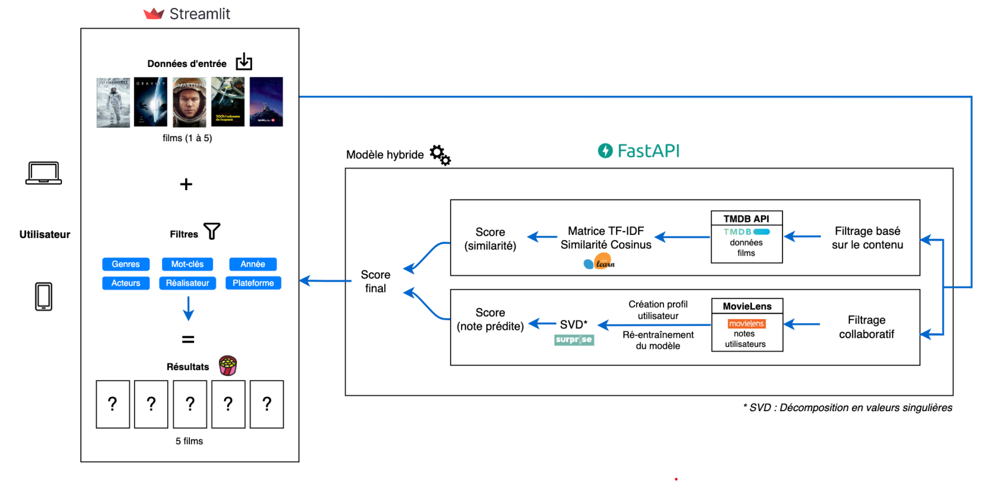

# MOVIE MATCHER
## Moteur de recommandation de films

    

## Introduction

Movie Matcher est un moteur de recommandation de films...

---

## Schéma des flux

    

---

## Notebooks

1) `01_TMDB_API_movie_vote.ipynb` : Télécharge le daily export de TMDB, filtre sur les `n` films les plus populaires, puis se connecte à l'API TMDB pour récupérer par film le nombre de votes et la moyenne des votes. Ensuite enregistre dans le fichier `src/TMDB_movie_vote.csv`. 

    Actuellement le fichier contient 20.000 films.

    Temps de traitement : ~ 2h pour 20.000 films.

2) `02_weighted_IMDB.ipynb` : Parmi les films de `src/TMDB_movie_vote.csv`, applique la formule weighted ratings de IMDB et déduit une liste de `n` films les mieux notés. Ensuite enregistre dans le fichier `src/TMDB_weighted_movies.csv`. De plus, importe `Movielens_links.csv` et `Movielens_ratings.csv`, filtre sur les films sélectionnés, puis effectue un sample pour limiter la taille du dataset. Enregistre les infos dans le fichier `src/Movielens_ratings_updated.csv`.

    Actuellement notre weighted IMDB conserve 3000 films.

3) `03_TMDB_API_content.ipynb` : Parmi les films de `src/TMDB_weighted_movies.csv`, se connecte à l'API TMDB pour récupérer, par film, les données suivantes :
    - TMDB/movie/details : tmdb_id, title, genres, release_date (year), poster_path
    - TMDB/movie/keywords : tmdb_id, keywords
    - TMDB/movie/credits : tmdb_id, cast (acteurs), director
    - TMDB/movie/watch/providers : tmdb_id, provider_id

    Temps de traitement : ~ 20 min pour 3000 films.

4) `04_collaborative_filtering.ipynb` : Défini la fonction de recommandation (collaborative filtering) à partir de la librairie Suprise et du modèle SVD, puis la teste sur une liste de films.

    Idéalement conserver entre 200.000 et 500.000 ratings (voir `02_weighted_IMDB.ipynb`).

---

## Nos formules mathématiques

1) Weighted IMDB score :

    $\text{Score} = \left( \frac{v}{v+m} \cdot R \right) + \left( \frac{m}{m+v} \cdot C \right)$

    **Où :**
    - $v$ est le nombre de votes pour le film
    - $m$ est le nombre minimum de votes requis pour figurer dans le classement
    - $R$ est la note moyenne du film
    - $C$ est la moyenne des votes au global

2) Hybrid system score :

    $Score_{film} = w_{CF} * S_{CF} + w_{CB} * (\frac{\sum_{i=1}^{n} S_{CB_i}}{n} + \alpha * n)$

    **Où :**
    - $w_{CF}$ est le poids pour le modèle de filtrage collaboratif,
    - $S_{CF}$ est la note prédite (si le film n'est pas présent dans le modèle de filtrage collaboratif, vous pouvez utiliser la moyenne des scores comme valeur par défaut),
    - $w_{CB}$ est le poids pour le modèle content-based,
    - $S_{CB_i}$ est le score de similarité content-based pour la \(i\)-ième occurrence du film,
    - $n$ est le nombre d'occurrences du film dans les prédictions du modèle content-based,
    - $\alpha$ est un paramètre de réglage.

## Instructions si aucun fichier n'est présent dans `src/`

1) Telecharger le dataset MovieLens : [Movielens dataset](https://files.grouplens.org/datasets/movielens/ml-latest.zip)

2) Deziper l'archive

    Renommer : `ratings.csv` en `Movielens_ratings.csv`

    Renommer : `links.csv` en `Movielens_links.csv`

    Mettre les fichiers dans `src/`

3) Lancez les notebooks `01`, `02` et `03` pour créer les fichiers nécessaires au machine learning

    Le fichier `Movielens_ratings.csv` (qui prend beaucoup de place) sera supprimé et remplacé par `Movielens_ratings_updated.csv`